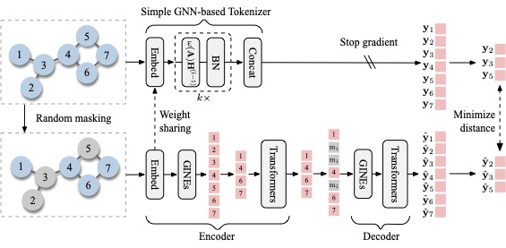

# Rethinking Tokenizer and Decoder in Masked Graph Modeling for Molecules

NeurIPS 2023 poster \[[paper](https://openreview.net/forum?id=fWLf8DV0fI)\]

Authors: Zhiyuan Liu, Yaorui Shi, An Zhang, Enzhi Zhang, Kenji Kawaguchi, Xiang Wang, Tat-Seng Chua


This repository contains the official code impementation for the paper **Rethinking Tokenizer and Decoder in Masked Graph Modeling for Molecules**.




**<center>Overview of the SimSGT's framework</center>**

## Citation

If you use our codes or checkpoints, please cite our paper:

```bibtex
@inproceedings{
    liu2023rethinking,
    title={Rethinking Tokenizer and Decoder in Masked Graph Modeling for Molecules},
    author={Liu, Zhiyuan and Shi, Yaorui and Zhang, An and Zhang, Enzhi and Kawaguchi, Kenji and Wang, Xiang and Chua, Tat-Seng},
    booktitle={NeurIPS},
    year={2023},
    url={https://openreview.net/forum?id=fWLf8DV0fI}
}
```